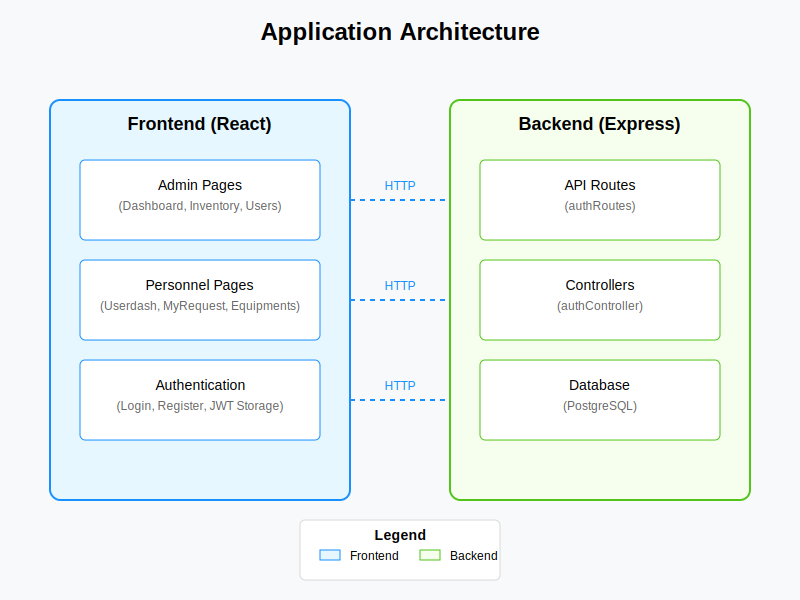

# TypeScript Application Documentation

## Project Overview

This document provides a comprehensive explanation of the codebase for the TypeScript application. The application is a full-stack web application built with React on the frontend and Node.js with Express on the backend. It implements a user authentication system with different user roles (admin and personnel) and various dashboard interfaces for each role.



*Figure 1: High-level architecture diagram showing the frontend and backend components*

## Project Structure

The project follows a typical full-stack application structure with separate directories for frontend and backend code:

```
├── backend/               # Backend Node.js/Express application
│   ├── src/               # Source code
│   │   ├── controllers/   # Business logic
│   │   ├── middleware/    # Express middleware
│   │   ├── routes/        # API routes
│   │   ├── db.ts          # Database connection
│   │   └── server.ts      # Express server setup
│   ├── .env               # Environment variables
│   └── package.json       # Dependencies
├── src/                   # Frontend React application
│   ├── Pages/             # Admin interface components
│   ├── Ppages/            # Personnel interface components
│   ├── App.tsx            # Main application component
│   └── main.tsx           # Application entry point
└── package.json           # Dependencies
```

## Frontend Architecture

### Component Structure

The frontend is built with React and uses React Router for navigation. The application has two main sets of pages:

1. **Admin Pages** (in `src/Pages/`): 
   - Dashboard.tsx - Main admin dashboard
   - Inventory.tsx - Equipment inventory management
   - Users.tsx - User management
   - Settings.tsx - Application settings
   - And more administrative interfaces

2. **Personnel Pages** (in `src/Ppages/`):
   - Userdash.tsx - User dashboard
   - MyRequest.tsx - Equipment request management
   - Equipments.tsx - Available equipment view
   - And more user-specific interfaces

### Authentication Flow

1. **Login Component** (`src/Pages/Login.tsx`):
   - Handles user authentication
   - Manages form state and validation
   - Makes API requests to the backend
   - Stores authentication token in localStorage
   - Redirects to appropriate dashboard based on user role

2. **Registration Component** (`src/Pages/register.tsx`):
   - Handles new user registration
   - Validates user input
   - Makes API requests to create new users
   - Provides feedback on registration status

### Routing

The application uses React Router for navigation, defined in `App.tsx`. Routes are protected based on user authentication status and role.

## Backend Architecture

### Server Setup

The backend is built with Express.js and TypeScript. The main server setup is in `server.ts`, which:

- Configures environment variables with dotenv
- Sets up Express middleware (CORS, JSON parsing)
- Defines API routes
- Starts the server on the configured port

### Authentication System

1. **Auth Routes** (`routes/authRoutes.ts`):
   - Defines endpoints for user registration and login
   - Handles input validation
   - Manages JWT token generation
   - Provides detailed error handling

2. **Auth Middleware** (`middleware/authMiddleware.ts`):
   - Protects routes requiring authentication
   - Verifies JWT tokens
   - Attaches user information to request objects

3. **Auth Controller** (`controllers/authController.ts`):
   - Contains business logic for authentication
   - Handles password hashing with bcrypt
   - Manages user creation and verification

### Database Integration

The application uses PostgreSQL for data storage, with connection setup in `db.ts`:

- Uses the `pg` package for PostgreSQL connection
- Configures connection pool based on environment variables
- Exports the pool for use in routes and controllers

## Key Features

### User Authentication

- Secure login and registration
- Password hashing with bcrypt
- JWT-based authentication
- Role-based access control (admin vs. personnel)

### Admin Dashboard

- Overview of system status
- Equipment inventory management
- User management
- Reporting and analytics

### User Dashboard

- Equipment browsing and filtering
- Equipment request management
- Personal settings
- Status updates

## Database Schema

The application uses a PostgreSQL database with the following main tables:

1. **users**:
   - id (primary key)
   - name
   - email (unique)
   - password (hashed)
   - created_at

## Security Considerations

1. **Password Security**:
   - Passwords are hashed using bcrypt before storage
   - Raw passwords are never stored in the database

2. **Authentication**:
   - JWT tokens are used for stateless authentication
   - Tokens have configurable expiration times

3. **Input Validation**:
   - All user inputs are validated before processing
   - SQL injection protection through parameterized queries

## Recent Fixes

1. **Port Configuration**:
   - Fixed port mismatch between frontend and backend
   - Frontend now correctly connects to backend on port 5000

2. **SQL Query Syntax**:
   - Fixed SQL syntax error in user registration
   - Implemented proper query formatting for PostgreSQL

## Development Workflow

1. **Backend Development**:
   - Run `npm run dev` in the backend directory to start the development server
   - Server runs on port 5000 by default

2. **Frontend Development**:
   - Run `npm run dev` in the project root to start the Vite development server
   - Frontend connects to backend API endpoints

## Conclusion

This TypeScript application demonstrates a well-structured full-stack web application with proper separation of concerns between frontend and backend. The authentication system provides secure user management, while the different interfaces cater to different user roles. The PostgreSQL database integration ensures reliable data storage and retrieval.